# Architecture

## Technology Stack
### **Backend**: Quarkus 
A Kubernetes-native Java stack. It is lightweight but robust. Developers can quickly build and deploy applications with it. It also has excellent support for reactive programming, which is essential for building scalable applications using it.
### **Frontend**: Angular
I already had experience with Angular, and it is a powerful framework for building dynamic web applications. It provides a rich set of features and tools that make development faster and easier.
### **Database**: PostgreSQL
A powerful, open-source relational database. I had experience with it, and it is known for its reliability, performance, and support for advanced features. Despite this application being relatively simple, I chose PostgreSQL because the relational nature and the ability to easily manage relationships between entities (like users and their tasks) made it a good fit for this project.
### **Authentication**: Quarkus Security and SmallRye JWT
Quarkus Security provides a simple and flexible way to handle authentication and authorization. SmallRye JWT is a library that allows us to easily implement JWT-based authentication in our Quarkus application. It provides support for generating and validating JWT tokens, making it easier to secure our API endpoints.
### **Containerization**: Docker
I used Docker to containerize the application, so that it can be easily deployed and run in any environment.
### **Build Tool**: Maven
I used Maven as the build tool for the project. It is a widely used build automation tool for Java projects, and it provides a simple and efficient way to manage dependencies and build the application.
### **JPA Provider**: Hibernate
I used Hibernate with Panache. A big part of time-saving was the usage of Panache. Panache is a Quarkus library that provides a simplified API for working with databases. It allows developers to write less boilerplate code when interacting with the database, making it easier and faster to develop applications. Panache provides a set of annotations and methods that allow you to define your entities and perform CRUD operations without having to write complex SQL queries or manage the underlying database connections. It also supports both imperative and reactive programming models, making it a versatile choice for building applications with Quarkus.

